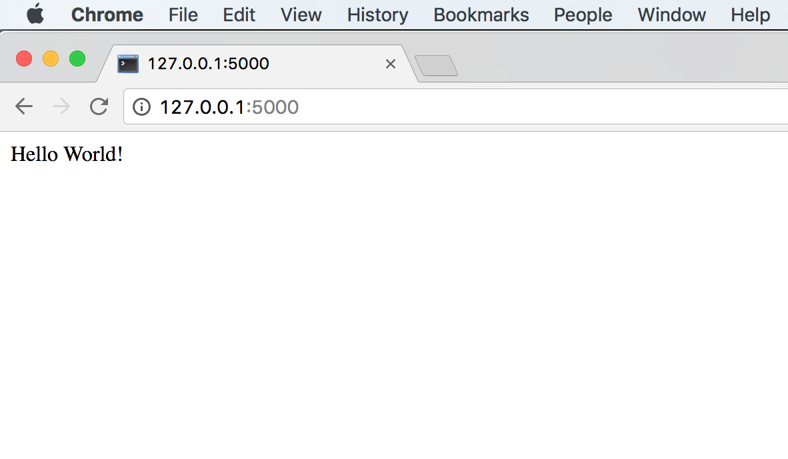
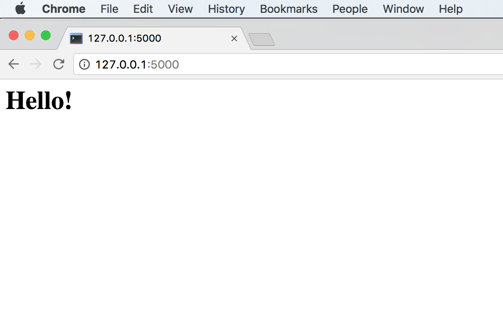
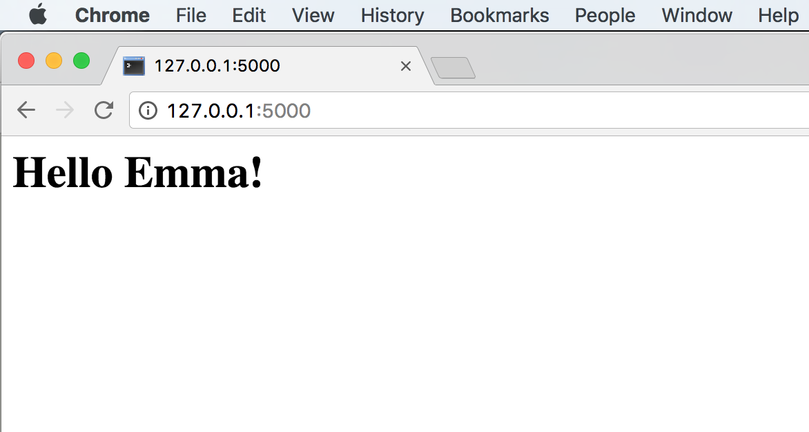
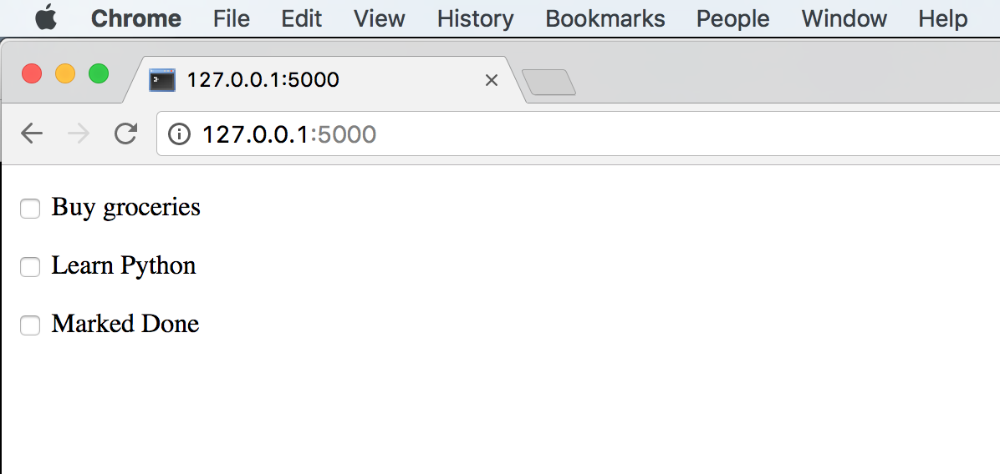
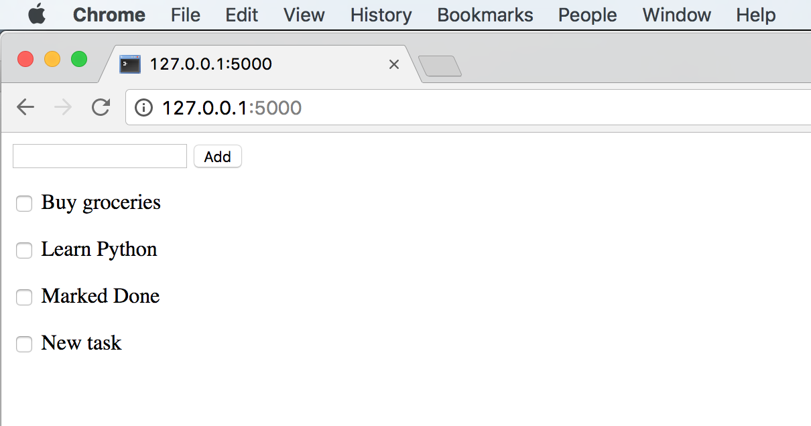
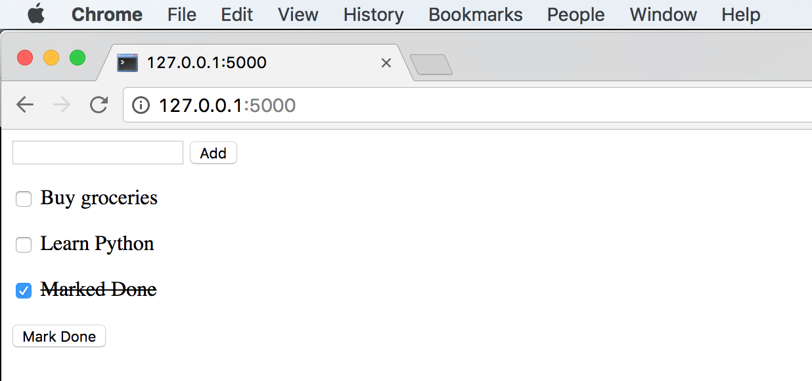
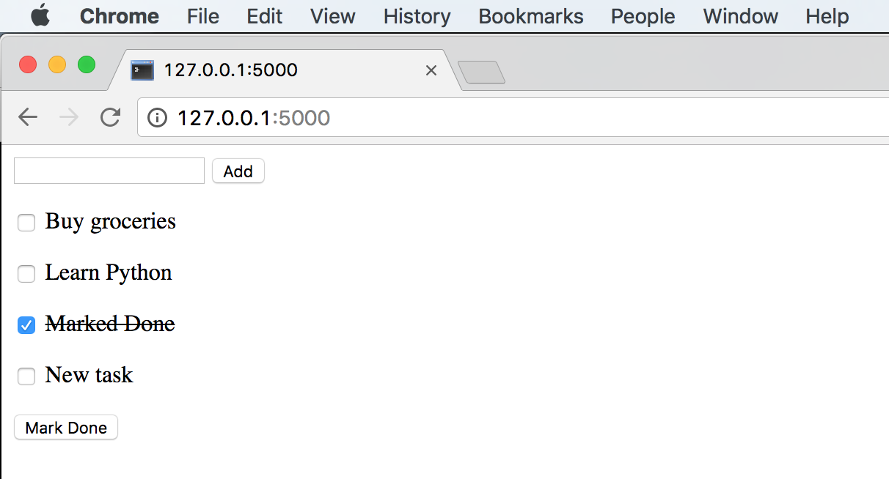
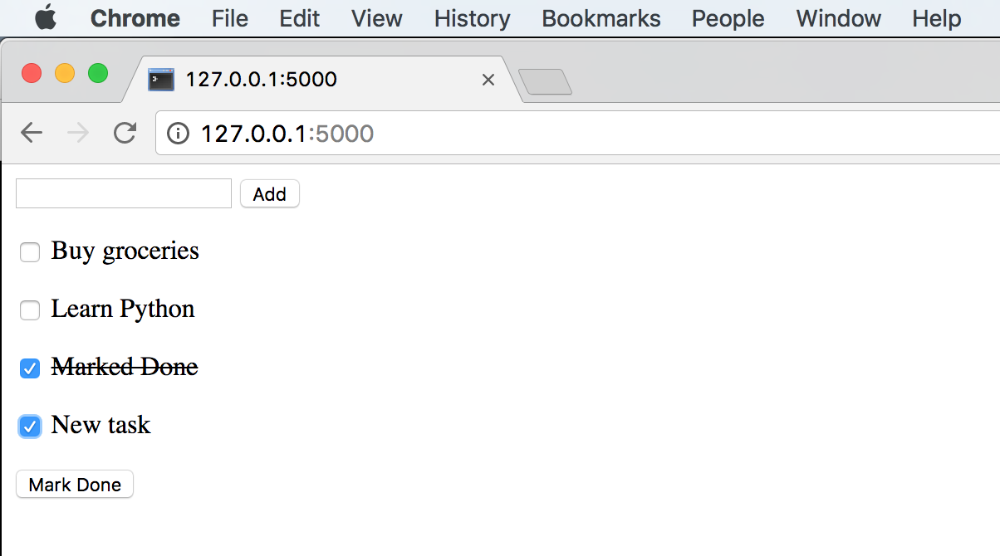
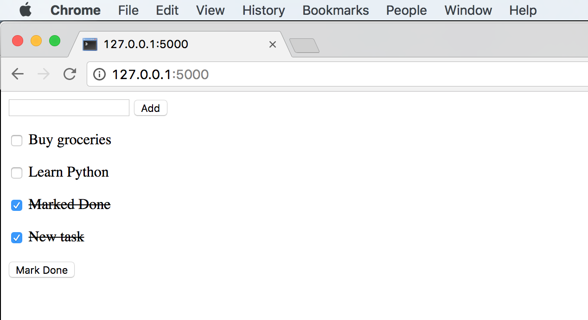

class: center, middle

#Web Development with Python

---

## Introduction

* If you want to create a static webpage i.e. one without a backend you can use HTML, CSS and JavaScript

--

* However as soon as you want to add complex functionality that involves storing data you will need to add a backend

--

* There are many ways to do this however the key components usually include a web server, a database, and some sort of application code

--

* You can install and operate each of these things individually, or use a web framework to help

---

## Web Frameworks

* A web framework is an application that helps manage the complexity of web development

--

* There are web frameworks written in many different programming languages

--

* Most languages have several different frameworks of varying popularity

---

## Python Web Frameworks

* There are many different Python web frameworks each with their own strengths and weaknesses

--

* Django is a full stack framework that comes with the "batteries included"

* Django is one of the most popular options when using Python for web development

--

* Tornado is a framework designed for high scalability

--

* Flask is a "microframework" that is more light weight than Django, but also a popular choice

--

* There is a full list of Python web frameworks on the [Python wiki](https://wiki.python.org/moin/WebFrameworks)

---

## Webpage Basics

* HTML stands for Hypertext Markup Language and is the fundamental element of a webpage 

--

* HTML is composed of elements like `<head>`, `<p>`, `` etc

--

* CSS stands for Cascading Style Sheets and is a method for customizing the appearance of a webpage

--

* JavaScript is a programming language that can be used to add functionality to the front end of a webpage

--

* In the past couple of years JavaScript has become a backend language with node.js

---

## Flask

* [Flask](http://flask.pocoo.org/) can be installed via pip or anaconda

--

* Unlike Django, Flask doesn't come with a database. You can use any database that has a Python driver

--

* Flask uses the [Jinja2](http://jinja.pocoo.org/docs/2.9/) as its templating engine

--

* Flask also has user created [extensions](http://flask.pocoo.org/extensions/) which can be easily installed and add functionality

---

## First Flask Application

hello.py

```
from flask import Flask
app = Flask(__name__)

@app.route("/")
def hello():
    return "Hello World!"

if __name__ == "__main__":
    app.run()
```

--

Running Flask

```
python hello.py
 * Running on http://127.0.0.1:5000/ (Press CTRL+C to quit)
```

---



---

## First Template

hello.py

```
from flask import Flask
from flask import render_template 
app = Flask(__name__)

@app.route("/")
def hello():
    return render_template('hello_template.html')

if __name__ == "__main__":
    app.run(debug=True)
```

hello_template.html

```
<h1>Hello</h1>
```
---



---

## Templates with Variables

hello.py

```
from flask import Flask
from flask import render_template
app = Flask(__name__)

name = "Emma"

@app.route("/")
def hello():
    return render_template('hello_template.html', name=name)

if __name__ == "__main__":
    app.run(debug=True)
```

hello_template.html

```
<h1>Hello {{name}}!</h1>
```
---



---

## Flask ToDo App

```
from flask import Flask
from flask import render_template, request, redirect, url_for
app = Flask(__name__)

tasks = [
    {
        'id': 0,
        'title': u'Buy groceries',
        'description': u'Milk, Cheese, Pizza, Fruit, Tylenol',
        'done': False
    },
    {
        'id': 1,
        'title': u'Learn Python',
        'description': u'Need to find a good Python tutorial on the web',
        'done': False
    },
    {
        'id': 2,
        'title': u'Marked Done',
        'description': u'',
        'done': True
    }
]
```
...

---

```
@app.route('/')
def hello():
    return render_template('show_todo-1.html', tasks=tasks) 

if __name__ == '__main__':
    app.run()
```

---

##ToDo App HTML

```
<!doctype html>



<p>
  <input type="checkbox" id={{task.id}} value="first_checkbox">
    <label for={{task.title}}>{{task.title}}</label>
	</p>

  <li><em>Unbelievable.  No entries here so far</em>



```

---



---

## Adding Tasks

todo-2.py

```
from flask import Flask
from flask import render_template, request, redirect, url_for
app = Flask(__name__)

tasks = [
    {
        'id': 0,
        'title': u'Buy groceries',
        'description': u'Milk, Cheese, Pizza, Fruit, Tylenol',
        'done': False
    },
    {
        'id': 1,
        'title': u'Learn Python',
        'description': u'Need to find a good Python tutorial on the web',
        'done': False
    },
    {
        'id': 2,
        'title': u'Marked Done',
        'description': u'',
        'done': True
    }
]
```

---

```
@app.route('/')
def hello():
    return render_template('show_todo-2.html', tasks=tasks)

@app.route('/add', methods=['POST'])
def add():
    newtask = request.form['new-task']
    lastid = tasks[-1]['id']
    newtask = {'id': lastid+1, 'title': newtask, 'done': False}
    tasks.append(newtask)
    return redirect(url_for('hello'))

if __name__ == '__main__':
    app.run()
```

---

show_todo-2.html

```
<!doctype html>

<form method="post" action="{{url_for('add')}}">
<input name="new-task" type="textbox">
<button>Add</button>
</form>


<p>
  <input type="checkbox" id={{task.id}} value="first_checkbox">
    <label for={{task.title}}>{{task.title}}</label>
	</p>

  <li><em>Unbelievable.  No entries here so far</em>



```

---



---

## Marking Done

todo-3.py

```
from flask import Flask
from flask import render_template, request, redirect, url_for
app = Flask(__name__)

tasks = [
    {
        'id': 0,
        'title': u'Buy groceries',
        'description': u'Milk, Cheese, Pizza, Fruit, Tylenol',
        'done': False
    },
    {
        'id': 1,
        'title': u'Learn Python',
        'description': u'Need to find a good Python tutorial on the web',
        'done': False
    },
    {
        'id': 2,
        'title': u'Marked Done',
        'description': u'',
        'done': True
    }
]
```

---

```
@app.route('/')
def hello():
    return render_template('show_todo-3.html', tasks=tasks)

@app.route('/add', methods=['POST'])
def add():
    newtask = request.form['new-task']
    lastid = tasks[-1]['id']
    newtask = {'id': lastid+1, 'title': newtask, 'done': False}
    tasks.append(newtask)
    return redirect(url_for('hello'))

@app.route('/done', methods=['POST'])
def done():
    doneids = request.form.getlist('todo')
    for id in doneids:
        tasks[int(id)]['done']=True
    return redirect(url_for('hello'))

if __name__ == '__main__':
    app.run()
```

---

show-todo.html

```
<!doctype html>

<form method="post" action="{{url_for('add')}}">
<input name="new-task" type="textbox">
<button>Add</button>
</form>

<form method="post" action="{{url_for('done')}}">


<p>
  <input type="checkbox" name="todo" value = {{task.id}} id={{task.id}} checked>
  <label for={{task.title}}><strike>{{task.title}}</strike></label>
</p>

<p>
  <input type="checkbox" name="todo" value = {{task.id}} id={{task.id}}>
  <label for={{task.title}}>{{task.title}}</label>
</p>


  <li><em>Unbelievable.  No entries here so far</em>


<button>Mark Done</button>
</form>


```

---



---



---



---



---
## Extending the Example

* Add JavaScript to improve the interaction

--

* Add CSS to improve the appearance

--

* Create a way to archive done tasks 

--

* Create a way to delete tasks

--

* Add an actual database as a data store
